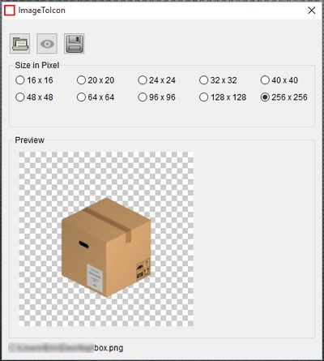

# ImageToIcon
Codé en avec le langage PureBasic, ImageToIcon transforme une image en icone.

■ Le principe.
- Chargée une image (BMP, JPEG, PNG).
- Définir la taille de l'icone.
- Sauvegarder l'icone dans le même dossier que l'image d'origine.

 
